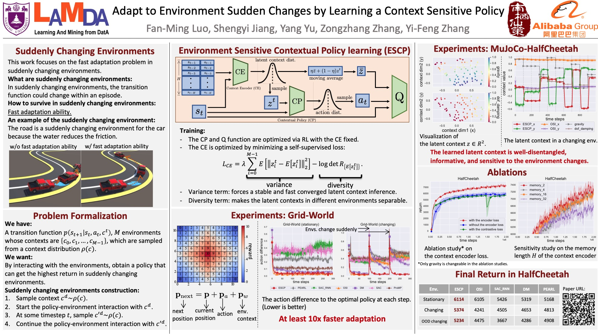

# ESCP
Code for [Adapt to Environment Sudden Changes by Learning a Context Sensitive Policy](https://www.aaai.org/AAAI22Papers/AAAI-6573.LuoF.pdf).

## Installation

Install the required python packages in `requirement.txt` by
```bash
pip install -r ./requirement.txt
```
Note: You can follow the instructions at [here](https://github.com/openai/mujoco-py) to properly install `mujoco-py`.

## Run

You can conduct the experiment in `HalfCheetah-v2` with the following command.
```bash
python main.py --env_name HalfCheetah-v2 --rnn_fix_length 16 --seed 5  --task_num 40 \
    --max_iter_num 2000 --varying_params  gravity  \
    --test_task_num 40 --ep_dim 2 \
    --name_suffix RMDM  --use_rmdm  --stop_pg_for_ep  --bottle_neck
```

There are several key parameters:
- `--env_name`: configures the environment you are going to conduct experiment on. The possible environments: `GridWorldPlat-v2,Hopper-v2,HalfCheetah-v2,Walker2d-v,Ant-v2,Humanoid-v2`.
- `--rnn_fix_length`: configures the memory length (H in the paper). 
- `--seed`: configures the random seeds.
- `--task_num`: configures how many environments are used for policy training (it should be set to `12` in `GridWorldPlat-v2`).
- `--test_task_num`: configures how many environments are used for policy testing (it should be set to `12` in `GridWorldPlat-v2`).
- `--varying_params`: configures what kinds of environment changes are used, refer to [code](envs/nonstationary_env.py) for all kinds of supported environment changes.